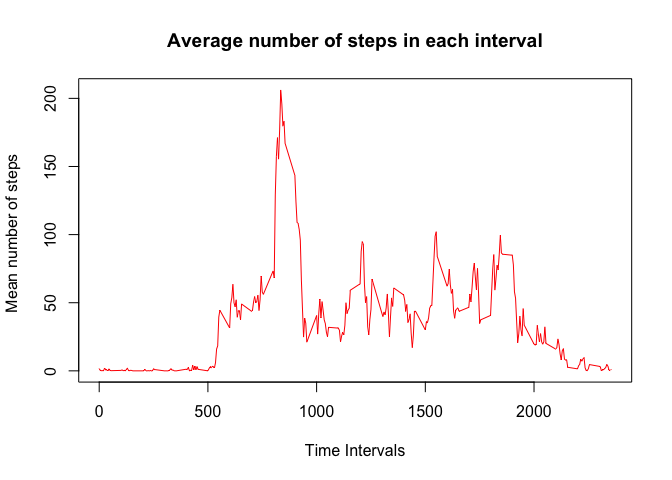
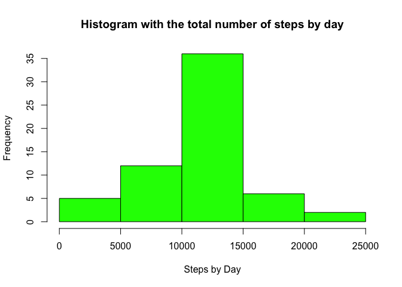
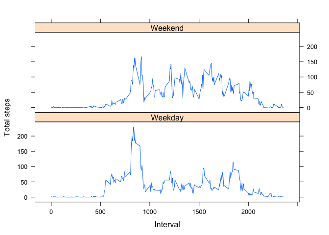

# PA1_template
Filippo Reviglio  
28/8/2017  


# Reproducible Research: Peer Assessment 1


##Loading and preprocessing the data

Assign libraries:

```r
library(lattice)
```

Load activity data
The variables included in this dataset are:
-steps: Number of steps taking in a 5-minute interval (missing values are coded as NA)
-date: The date on which the measurement was taken in YYYY-MM-DD format
-interval: Identifier for the 5-minute interval in which measurement was taken


```r
actd <- read.csv("activity.csv")
```

Convert dates to Date class:

```r
actd$date <- as.Date(actd$date,"%Y-%m-%d")
```


## What is mean total number of steps taken per day?

Calculate total number of steps taken every day

```r
stepsbyday <- tapply(actd$steps, actd$date,sum)
```

Create an histogram with total number of steps by day:

```r
hist(stepsbyday,col="green",xlab="Steps by Day", 
      ylab="Frequency", main="Histogram with the total number of steps by day")
```

<!-- -->

Calculate Mean steps by day:

```r
mean(stepsbyday,na.rm=TRUE)
```

```
## [1] 10766.19
```

Calculate Median steps by day:

```r
median(stepsbyday,na.rm=TRUE)
```

```
## [1] 10765
```

## What is the average daily activity pattern?

Calculate mean steps by time interval:

```r
steps_by_interval <- tapply(actd$steps,actd$interval,
                                 mean,na.rm=TRUE)
```

Plot intervals and average number of steps:

```r
plot(row.names(steps_by_interval), steps_by_interval,type="l",
     xlab="Time Intervals", 
     ylab="Mean number of steps ", 
     main="Average number of steps in each interval",
     col="red")
```

<!-- -->

Find interval with max average number of steps:

```r
stp <- as.data.frame(steps_by_interval)
names(stp[which.max(stp[,1]),])
```

```
## [1] "835"
```


## Imputing missing values

Find total missing values:

```r
num_na <- sum(is.na(actd))
num_na 
```

```
## [1] 2304
```

Overwrite missing values with the mean interval value to a new dataset:

```r
actd2 <- actd
nindex <-  which(is.na(actd2)) #map row with NA values
for (i in nindex) {
     {
             ind <- actd2[i,3]
             actd2$steps[i] = steps_by_interval[as.character(ind)]
    }
}
```

Find total missing values for the new dataset:

```r
sum(is.na(actd2))
```

```
## [1] 0
```

Make a histogram of the total number of steps taken each day:

```r
stepsbyday2 <- tapply(actd2$steps, actd2$date,sum)
hist(stepsbyday2,col="green",xlab="Steps by Day", 
      ylab="Frequency", main="Histogram with the total number of steps by day")
```

<!-- -->

Calculate Mean steps by day for new dataset:

```r
mean(stepsbyday2,na.rm=TRUE)
```

```
## [1] 10766.19
```

Calculate Median steps by day for the dataset:

```r
median(stepsbyday2,na.rm=TRUE)
```

```
## [1] 10766.19
```


## Differences in activity patterns between weekdays and weekends

Create a new factor variable in the dataset with two levels -- "weekday" and "weekend" indicating whether a given date is a weekday or weekend day:

```r
Sys.setlocale("LC_TIME", "en_US")
```

```
## [1] "en_US"
```

```r
days <- weekdays(actd2$date)

actd2$dtype <- ifelse(days == "Saturday" | days == "Sunday", 
                                "Weekend", "Weekday")

stepsInterv <- with(actd2, aggregate(steps, by=list(interval, dtype), mean))

names(stepsInterv) <- c("interval","dtype","steps")
```

Make a panel plot containing a time series plot (i.e. type = "l") of the 5-minute interval (x-axis) and the average number of steps taken, averaged across all weekday days or weekend days (y-axis):

```r
xyplot(steps~interval | dtype, stepsInterv,layout=c(1,2), type="l",
       xlab="Interval",ylab = "Total steps")
```

<!-- -->


